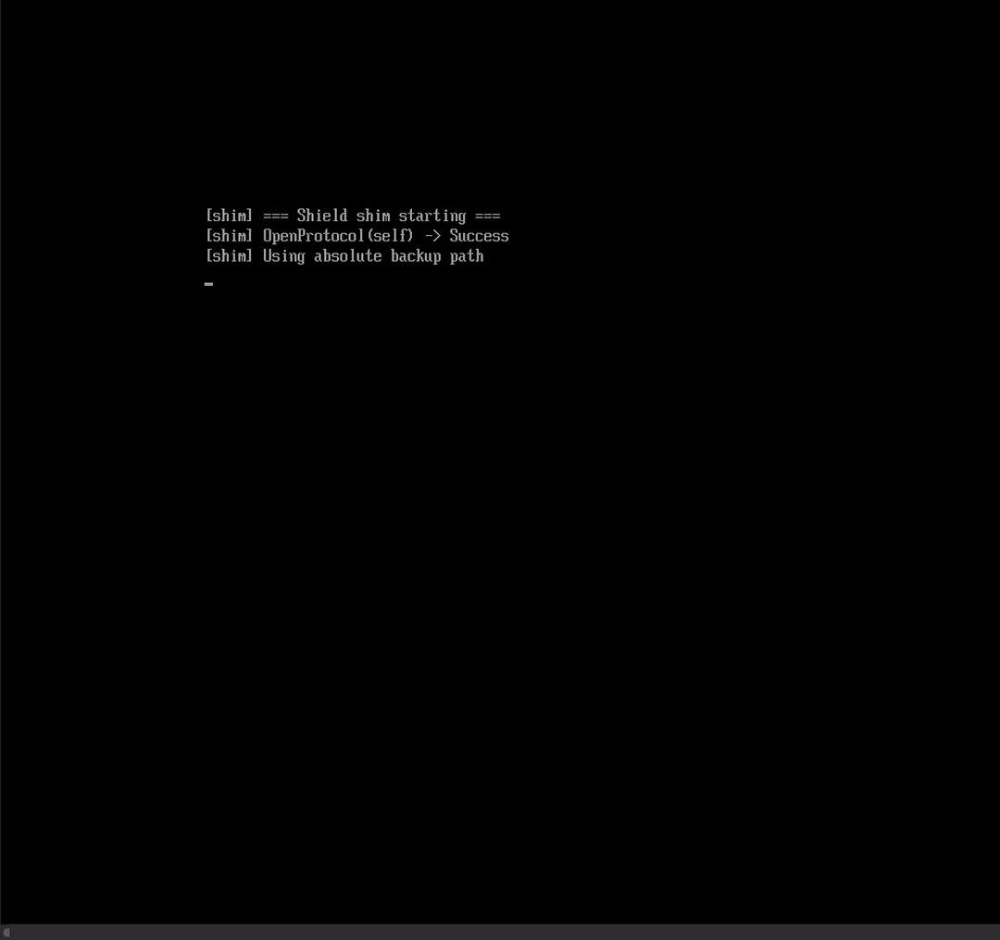

# DEFCON33 - Kill Chain Reloaded
Welcome to the repository for the DEF CON 33 talk: **Kill Chain Reloaded**.  
This repo contains progressive demos that showcase how Secure Boot, BitLocker, WPBT, and vulnerable drivers can be abused in modern bootkits and persistence mechanisms.

  

---

## Directory Structure

- `0_demo_ascii/` - EFI loader with ASCII art (basic Secure Boot bypass).
- `1_demo_acpi_lenovo/` - Advanced WPBT + LUFT table injection (persistence via Lenovo-signed tools).
- `2_demo_loader/` - Secure Boot protocol patching and BitLocker disablement.
- `3_demo_customcatalog/` - Custom tooling for finding and analyzing vulnerable drivers from Microsoft’s catalog.

---

## Demos

### Demo 0: ASCII Art Loader (Secure Boot Bypass Proof-of-Concept)
- Verifies Secure Boot is enabled.
- Installs a custom EFI loader that:
  - Loads `ShieldManager`, which loads an unsigned binary (`Shield.efi`).
  - Displays a custom ASCII animation.
  - Chainloads the original boot manager (Windows boots normally).
- Demonstrates early stage EFI-based execution while Secure Boot is active.

📁 Directory: `0_demo_ascii/`

---

### Demo 1: Lenovo WPBT Abuse with ACPI LUFT Table
- Confirms Secure Boot is active and the system is clean.
- EFI installer deploys a UEFIshell to patch:
  - The **Windows Platform Binary Table (WPBT)**.
  - Adds a custom **LUFT ACPI table**.
- At boot, Session Manager executes a Lenovo-native signed binary that:
  - Drops and loads a signed but vulnerable driver (`hell.sys`).
  - Configures a persistent service (`2srvdriver`).
- Results in persistent kernel-mode access from preboot.

📁 Directory: `1_demo_acpi_lenovo/`

---

### Demo 2: BitLocker Disablement + Secure Boot Protocol Patch
- Validates BitLocker and Secure Boot are enabled.
- Installer disables BitLocker via WMI and replaces ESP files.
- After reboot:
  - Loads a signed restricted UEFI shell.
  - Loads a custom Stage 0 binary that:
    - Enrolls a functional UEFI shell into MOK.
  - Attempts to load an unsigned binary (fails due to Secure Boot).
  - Secure Boot protocol is patched (manual `xor rax, rax; ret`).
  - Unsigned binary now loads successfully.
- BitLocker is bypassed, Secure Boot is neutered, Windows boots.

📁 Directory: `2_demo_loader/`

---

### Demo 3: Custom Catalog Vulnerable Driver Scraper
- Python script to:
  - Search Microsoft driver catalog for known-vulnerable drivers.
  - Download them.
  - Extract and analyze binaries.
  - Identify potentially exploitable functions.
- Useful for finding vulnerable drivers.

📁 Directory: `3_demo_customcatalog/`

---

### Demo 4.0: Persistent Service with Reverse Shell and IOCTL Orchestration

The service (`hell`) is installed as a standalone process and performs three main actions:

- Launches a reverse shell (`cmd.exe`) over a TCP connection to a predefined host.
- Orchestrates privileged operations via `DeviceIoControl` calls to the vulnerable driver.
- Uses the Windows API to send messages to the active user session.

📁 Directory: `4_demo_drivers/`

---

### Demo 4.1: Vulnerable Driver Install/Abuse (BYOVD) + Dependent Service Orchestration

This script performs the following actions:

- Installs and starts a vulnerable driver (`HWAudioX64.sys`) via the Windows Service Control Manager (SCM), granting kernel-level functionality through custom IOCTLs.
- Detects and terminates protected processes like Defender (`MsMpEng.exe`) and CrowdStrike (`CSFalconService.exe`) using the vulnerable driver, even if they are protected against standard termination.
- Installs and starts the `hell` service, configured as dependent on the vulnerable driver to ensure persistence and automatic exploitation after reboot.
- Continuously monitors and kills any EDR process that restarts.

📁 Directory: `4_demo_drivers/`

---

## ⚠️ Disclaimer

This repository is for educational and research purposes only.  
We cannot include precompiled binaries or certain files **for legal reasons**.  
You will need to **compile and obtain certain components yourself**.

---

## Requirements

Some components may require:
- UEFI development environment (EDK2 or similar).
- Python 3.x (for Demo 3).
- Windows VM with Secure Boot and BitLocker enabled for testing.

---

## Credits

Authors: 0xedh, borjmz  
Talk: DEF CON 33 - Kill Chain Reloaded  

---

## Use Responsibly

This code demonstrates security weaknesses and techniques intended to raise awareness. Do not deploy on production systems or without proper authorization.
